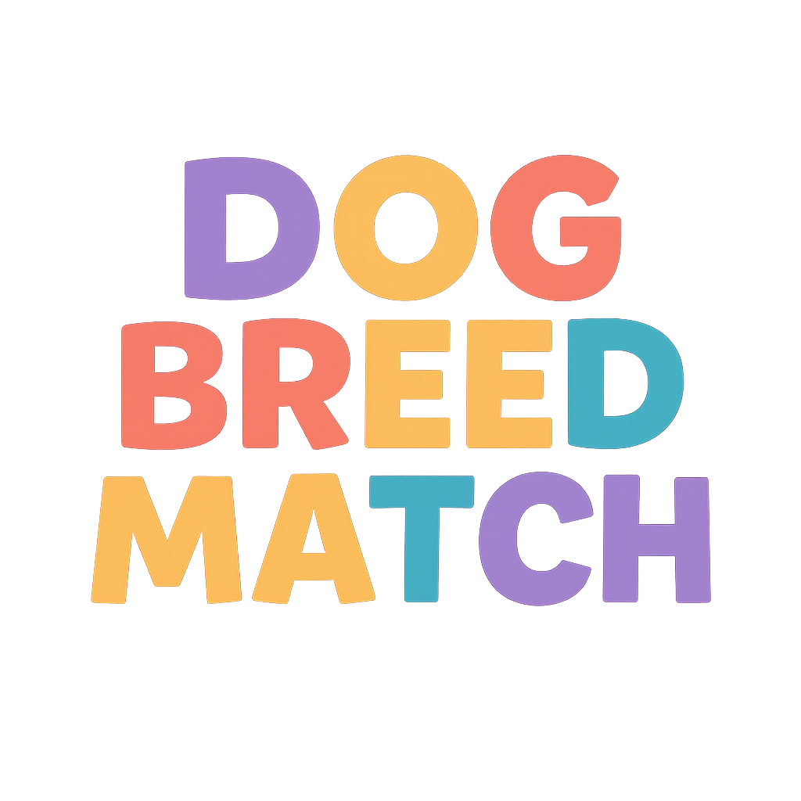

# 🐕 Dog Breed Match - Memory Game

<p align="center">
  
</p>

A fun, browser-based memory matching game featuring the top 12 dog breeds. Match all pairs to win!

<p align="center">
  
</p>

## 🎮 Game Features

- **24 tiles** arranged in a 6×4 grid
- **12 matching pairs** of dog breed caricatures
- **Two game modes**: Single Player & Two Player
- **Custom player names** - enter your name before playing
- **Game timer** - tracks how long each game takes
- **Visual turn indicator** - see whose turn it is in 2-player mode
- **Animated tile flips** with smooth 3D effects
- **Score tracking** with highlighted active player
- **Responsive design** - works on desktop and mobile
- **Single player mode** hides player 2 for a cleaner UI

## 🚀 How to Play

1. Open `index.html` in any modern web browser
2. Click **Start Game**
3. Choose **Single Player** or **Two Players**
4. Enter your name(s)
5. Click **Continue** to start
6. Click tiles to flip them and reveal the dog breed
7. Match pairs to score points
8. Try to match all 12 pairs in the fastest time!

## 📸 Screenshots

<p align="center">
  
  
</p>

<p align="center">
  
  
</p>

## 🛠️ Installation

### Option 1: Direct Play (Easiest)
Simply open `index.html` in any modern web browser - no installation needed!

```bash
# Just open in browser
open index.html
# or
firefox index.html
```

### Option 2: Local Server (Recommended)
Run a local server for the best experience:

```bash
# Using Python
python3 -m http.server 8000

# Then open http://localhost:8000 in your browser
```

### Option 3: Host Anywhere
This is a static HTML file - host it anywhere:
- GitHub Pages
- Netlify
- Vercel
- Any web hosting

## 🎨 Design

- Kid-friendly, colorful design with:
  - Playful Fredoka One font for headings
  - Soft gradient backgrounds
  - Paw print pattern on tile backs
  - Smooth hover and click animations
  - AI-generated dog breed caricatures

## 📱 Browser Support

Works in all modern browsers (Chrome, Firefox, Safari, Edge)

## 🧪 Testing

Run the automated test suite:

```bash
npm install
npm test
```

The test suite verifies all game functionality.

## 🤝 Contributing

Built with [The Hive](https://github.com/drpau/The-Hive) - an autonomous AI workflow system on OpenClaw.

## 📄 License

ISC
